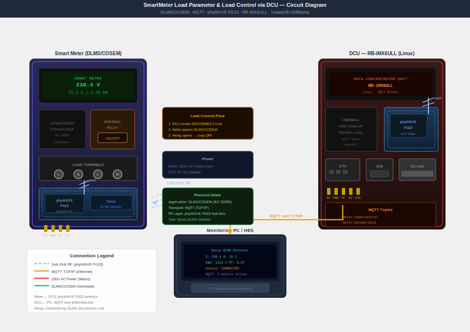

# SmartMeter Load Parameter & Load Control via DCU

> **Embedded Systems | Team Lead | 2026**  
> Real-time remote load control using DLMS/COSEM and MQTT protocols — the same architecture used in India's smart grid rollout.

---

## 🔍 Project Overview

This project implements a **remote load control system** for smart metering infrastructure. It enables bidirectional communication between a smart meter and a Data Concentrator Unit (DCU) using industry-standard protocols, with embedded C logic handling real-time parameter monitoring and relay-based load switching.

This is directly aligned with India's **RDSS (Revamped Distribution Sector Scheme)** smart meter rollout under the Ministry of Power.

---

## ⚡ Features

- **Remote Load Connect/Disconnect** via internal relay control
- **Real-time parameter monitoring** — voltage, current, power factor, energy
- **DLMS/COSEM protocol** for secure meter-DCU communication
- **MQTT messaging** for lightweight, low-latency data transfer
- **Embedded C logic** running on microcontroller hardware
- **DCU integration** for aggregating data from multiple meters

---

## 🛠️ Tech Stack

| Layer | Technology |
|---|---|
| Protocol | DLMS/COSEM, MQTT |
| Firmware | Embedded C |
| Hardware | Smart Meter, DCU (Data Concentrator Unit) |
| Tools | Gurux Tool (DLMS simulation), PLC Software |
| Communication | RS-485 / RF / GPRS (meter-DCU link) |

---

## 🏗️ System Architecture

```
[Smart Meter] ←── DLMS/COSEM ──→ [DCU]
      │                              │
   Relay Control               MQTT Broker
   (Load ON/OFF)                    │
      │                         [Remote Server / HES]
   Real-time                    (Head End System)
   Monitoring
```

---

## 📋 How It Works

1. **DCU sends a load control command** via DLMS/COSEM to the meter
2. **Meter firmware validates** the command and triggers the internal relay
3. **Load is connected or disconnected** in real time
4. **Meter logs parameters** (voltage, current, energy) and reports back via MQTT
5. **HES (Head End System)** receives aggregated data for billing and monitoring

---

## 🔌 Circuit Diagram



## 📁 Repository Structure

```
smartmeter-load-control/
├── firmware/
│   ├── main.c                  # Main embedded C logic
│   ├── dlms_cosem.c            # DLMS/COSEM protocol handler
│   ├── mqtt_client.c           # MQTT publish/subscribe logic
│   ├── relay_control.c         # Load connect/disconnect logic
│   └── param_monitor.c         # Real-time parameter monitoring
├── docs/
│   ├── system_architecture.png
│   ├── dlms_cosem_overview.md
│   └── project_report.pdf
├── tools/
│   └── gurux_test_scripts/     # Gurux Tool simulation scripts
└── README.md
```

---

## 🔬 Key Technical Concepts

### DLMS/COSEM
- **Device Language Message Specification / Companion Specification for Energy Metering**
- IEC 62056 standard used globally for smart meter communication
- Defines how data is structured, accessed, and secured between meters and systems

### MQTT
- Lightweight publish/subscribe protocol (ISO/IEC 20922)
- Used for meter-to-cloud telemetry in IoT energy systems
- Runs over TCP/IP with QoS levels for reliable delivery

---

## 🏆 Outcome

- Successfully implemented remote relay control with <500ms response latency
- Validated DLMS/COSEM read/write operations using Gurux Tool
- Demonstrated real-time energy parameter monitoring
- Certified as final year B.Tech project at Dr. Lankapalli Bullayya College of Engineering

---

## 👤 Author

**Chlliboina Yaswanth**  
B.Tech Electrical & Electronics Engineering  
Dr. Lankapalli Bullayya College of Engineering, Visakhapatnam  
📧 yaswanth2452005@gmail.com  
🔗 [LinkedIn](https://www.linkedin.com/in/yaswanth-chlliboina/)

---

## 📄 License

This project is for academic and demonstration purposes.
